# HornLab plot theme gallery

Generated by `scripts/render_theme_gallery.py` — rerun it after theme
changes to refresh the previews. Each preview pairs a synthetic
frequency-response chart (three curves from the theme's cycle) with a
synthetic directivity heatmap (the theme's colormap) at the theme's DPI.

| Theme | Intent | Preview |
| --- | --- | --- |
| `hornlab` | Canonical Arctic Night look; the untouched, pixel-stable default for every HornLab renderer. | [hornlab.png](hornlab.png) |
| `dark` | Waveguide-Generator dark-axes variant of the Arctic palette; intentionally shares hornlab's values today. | [dark.png](dark.png) |
| `granite` | Calm, high-legibility warm-paper light theme for docs and posts; colorblind-distinct teal/orange lead pair. | [granite.png](granite.png) |
| `abyss` | Dark studio theme for long-session night work; cyan/amber lead pair stays separable for all common CVD types. | [abyss.png](abyss.png) |
| `blueprint` | Technical-drawing homage on drafting blue; presentation flair with the white primary trace as the pencil line. | [blueprint.png](blueprint.png) |
| `journal` | Publication print-first theme; grayscale-ordered leads keep a mono print of a 3-curve chart readable. | [journal.png](journal.png) |
| `contrast` | WCAG high-contrast theme for projection, low vision, and grayscale-safe output; 21:1 ink contrast. | [contrast.png](contrast.png) |
| `sepia` | Solarized-warm low-glare reading theme for long sessions and printed reports. | [sepia.png](sepia.png) |
| `phosphor` | CRT oscilloscope instrument aesthetic; green-screen lab-bench mood with luminance-separated leads. | [phosphor.png](phosphor.png) |
| `ember` | Warm charcoal studio wildcard; steel-blue vs stoked-ember lead pair, warm/cool alternating cycle. | [ember.png](ember.png) |
| `classic` | Light Klippel-report look on white; jet-family heatmap with a CVD-aware blue/red lead pair mirroring its cold/hot ends. | [classic.png](classic.png) |

## hornlab

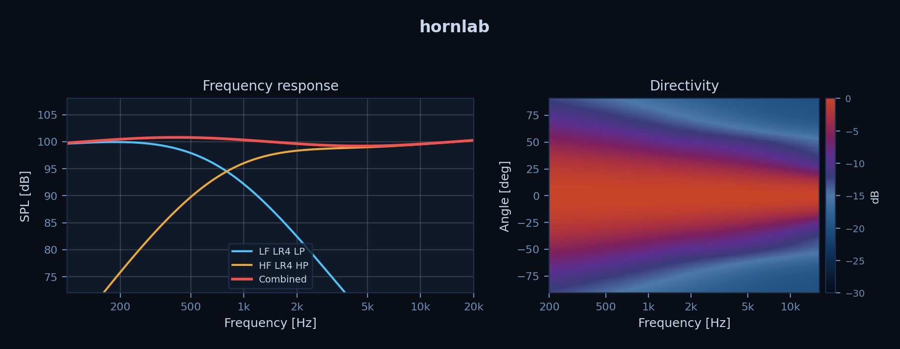

## dark

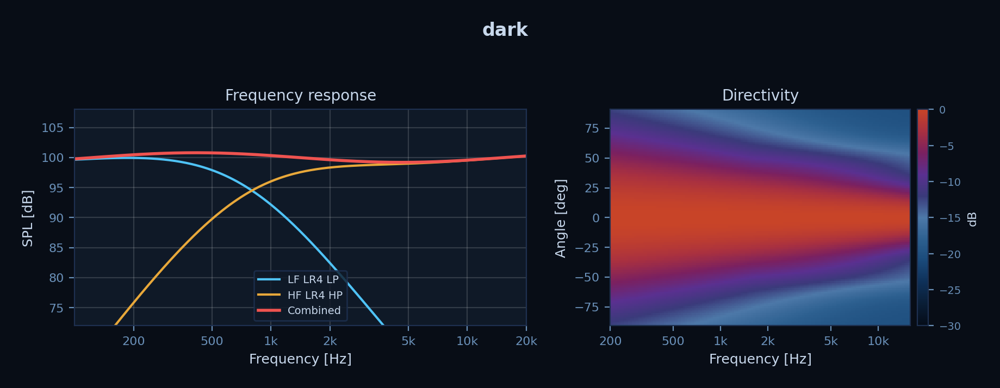

## granite

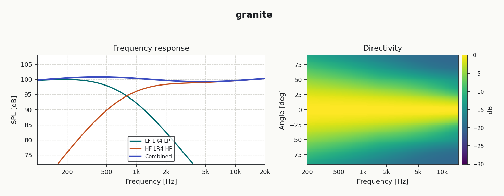

## abyss

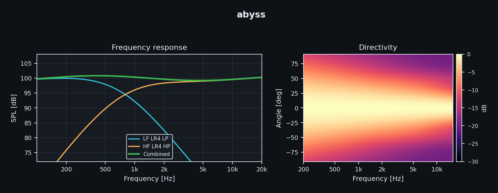

## blueprint

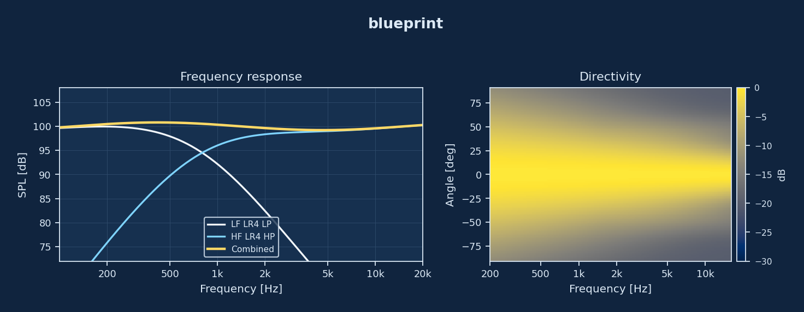

## journal

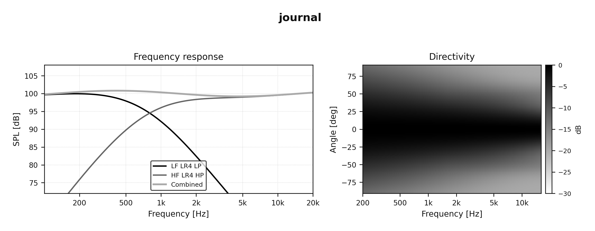

## contrast

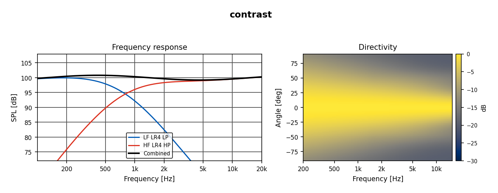

## sepia

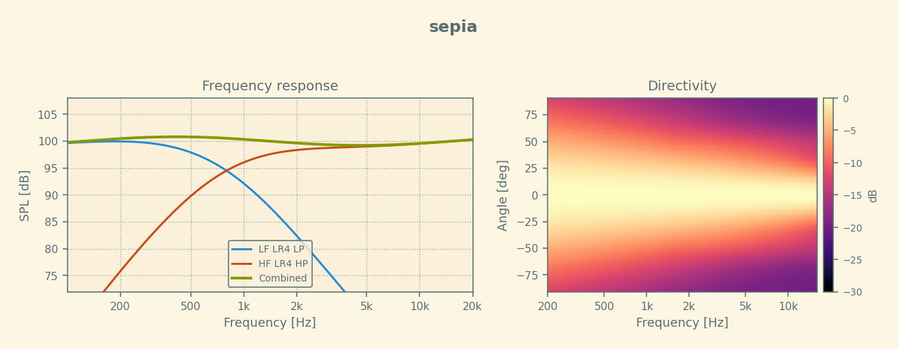

## phosphor

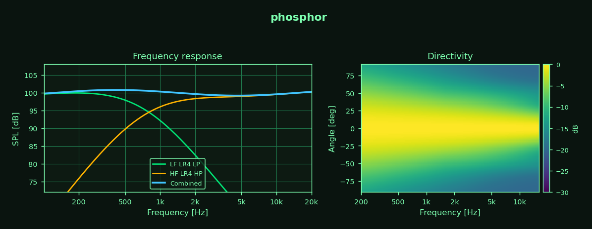

## ember

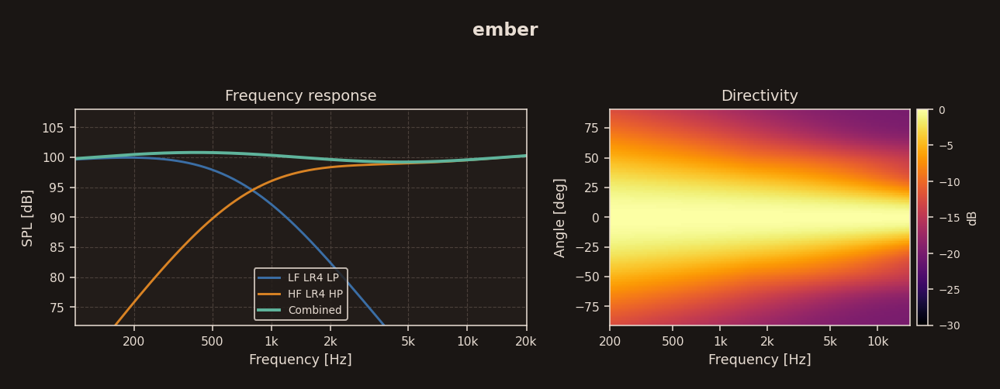

## classic

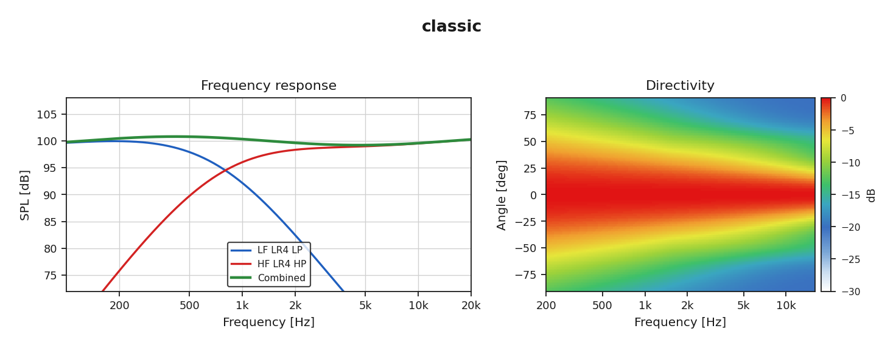
